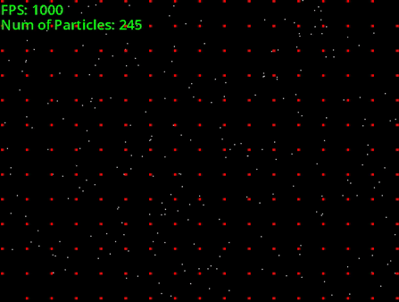

# Simple-OOP-Collisions
Simple Object Oriented Programming Project made in 2nd year of university, exploring how to efficently compute collisions between a lot of objects at the same time using a Hash Table.

**Examples**  
An Example of increasing and decreasing particles during run time 

As well as some examples of the "Infected" feature that change the colour of the particles as they collide with other infected particles.(Note FPS may not be correct due to GIF Compression)

## How to use
If you would like to run the program, download the release folder and run .exe 

**Controls** 
- 1 to increase particles
- 2 to decrease particles
- 3 to reset infection
- Space to start infection
